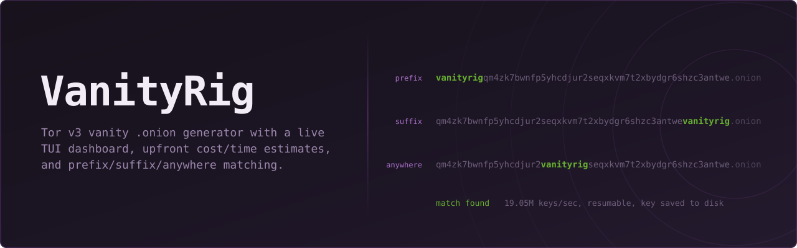

<p align="center">
  
</p>

<p align="center">
  <a href="https://github.com/bytestrix/vanityrig/actions/workflows/ci.yml"></a>
  <a href="https://pkg.go.dev/github.com/bytestrix/vanityrig"></a>
  <a href="https://goreportcard.com/report/github.com/bytestrix/vanityrig"></a>
  <a href="LICENSE"></a>
</p>

<p align="center">
  <a href="#quick-start">Quick start</a> ·
  <a href="#usage">Usage</a> ·
  <a href="#why-vanityrig">Why VanityRig</a> ·
  <a href="#contributing">Contributing</a> ·
  <a href="SECURITY.md">Security</a>
</p>

---

## What is it?

A Tor v3 `.onion` address is 56 random-looking characters. VanityRig finds
one containing a word you choose — at the start, at the end, or anywhere in
the middle — and tells you honestly what that will cost **before** it spends
any CPU time on it.

It's built on [`mkp224o`](https://github.com/cathugger/mkp224o), the
standard generator for this, and adds the three things that tool doesn't
have: an accurate up-front time/cost estimate, a live progress dashboard, and
the ability to match a word anywhere in the address rather than only at the
start — which is often dramatically faster than people expect.

---

## Quick start

**1. Install**

```sh
curl -fsSL https://raw.githubusercontent.com/bytestrix/vanityrig/main/install.sh | bash
```

Downloads the right prebuilt binary for your OS/architecture from the
[latest release](https://github.com/bytestrix/vanityrig/releases/latest) —
no Go toolchain required. Linux and macOS only; Windows users, grab the
`.zip` from the releases page directly.

**2. Run it**

```sh
vanityrig
```

That's it — no flags to learn. A real dashboard opens, with everything on one
screen at once: a **Settings** panel (word, save location, match mode,
CPU share) and a **Log / Status** panel showing live cost estimates for
prefix/suffix/anywhere as you type. Tab between fields, arrow keys to change
a selection, enter to start — the settings panel freezes in place and the
log panel switches to live search progress, without ever leaving this
screen.

Already know what you want? Skip the prompts with `vanityrig <word> [flags]`
— see [Usage](#usage) below.

<details>
<summary>Other ways to install</summary>

**Debian/Ubuntu (.deb) or Fedora/RHEL (.rpm):** download the package for
your architecture from the
[latest release](https://github.com/bytestrix/vanityrig/releases/latest)
and install it:

```sh
sudo dpkg -i vanityrig_*_linux_amd64.deb      # Debian/Ubuntu
sudo rpm -i vanityrig_*_linux_amd64.rpm       # Fedora/RHEL
```

**Go toolchain already installed:**

```sh
go install github.com/bytestrix/vanityrig/cmd/vanityrig@latest
```

**Build from source:**

```sh
git clone https://github.com/bytestrix/vanityrig.git
cd vanityrig
make build
make test
```

Optional, for any install method: put
[`mkp224o`](https://github.com/cathugger/mkp224o) on your `PATH`. VanityRig
uses it automatically for prefix searches — it's roughly 8x faster per core
than VanityRig's own engine for that mode (measured, not estimated — see
`internal/engine/bench_test.go`). Suffix and anywhere searches always run on
VanityRig's built-in engine, since `mkp224o` can't do those at all.

</details>

---

## Usage

```sh
vanityrig                          # guided prompts (see Quick start above)
vanityrig <word> [word...] [flags] # the same thing, one command — for scripts and repeat use
```

If you don't say where the word should go, it compares prefix, suffix, and
anywhere, and asks:

```sh
vanityrig vanityrig                          # compares all 3 modes, asks which to run
vanityrig vanityrig -match anywhere          # skip the question, go straight to anywhere mode
vanityrig vanityrig ritrigvan -stop-after 3  # OR search, stop after 3 total matches
vanityrig vanityrig -check                   # just the numbers, don't offer to run anything
vanityrig vanityrig -y                       # skip every prompt, use the recommended mode
```

| Flag | Default | Meaning |
|---|---|---|
| `-match` | *(ask)* | `prefix`, `suffix`, or `anywhere` — skips the question if set |
| `-out` | `~/.vanityrig/keys` | where found keys are saved |
| `-threads` | all cores | CPU threads to use |
| `-stop-after` | `0` (never) | stop once this many matches are found |
| `-rate` | `22.2M` | assumed combined keys/sec, used for the estimate |
| `-budget` | `24h` | longest search you'd accept, for alternatives |
| `-check` | off | show the estimate and exit — don't offer to search |
| `-y` | off | skip every prompt and start immediately |
| `-plain` | off | plain log lines instead of the live dashboard |

Press `q`, `Esc`, or `Ctrl-C` to stop a running search. Progress is saved
continuously, so running the same word again continues from where it left off
instead of starting over. A match is written to disk **before** it's
announced, so a crash between finding and saving can't lose it.

**Exit codes:** `0` achievable (however long the odds), `1` unsatisfiable
(well formed, but no matching address exists in any mode), `2` malformed
input.

---

## Why VanityRig

- **Matches anywhere in the address, not just the start.** A word has up to
  47 possible positions in a 56-character address — matching any of them is
  often 10-50x faster than pinning it to the front. No other generator
  supports this.
- **Compares where the word can go, not just how long it takes.** Prefix,
  suffix, and anywhere have very different costs for the same word, so
  VanityRig checks all three and tells you which is achievable — instead of
  silently assuming prefix, or offering to shorten your word to make it
  faster.
- **Catches impossible searches before you waste time on them.** The last two
  characters of every v3 address are constrained by the protocol — some
  words can never appear at the end. VanityRig names the exact rule and
  offers a fix (search all four legal endings together) instead of searching
  forever for something that can't exist.
- **Shows its work.** Every estimate is a real, checkable calculation —
  exponent form, exact count, assumed rate — so a wrong number is visible on
  its face rather than hidden behind a verdict.
- **Has its own search engine**, so suffix and anywhere-position matching
  actually run instead of being advertised and silently unsupported. Keys
  are byte-identical to `mkp224o`'s output, verified in the test suite. It
  batches the expensive part of key generation (a modular field inversion)
  across many candidates at once instead of paying it per key, which is
  roughly 11x faster than the straightforward version of the same engine —
  measured, not estimated.

---

## Contributing

Contributions welcome. See [CONTRIBUTING.md](CONTRIBUTING.md) and the
[Code of Conduct](CODE_OF_CONDUCT.md). Open an issue before a large PR.
`make test` and `make lint` must pass.

New here? Start with [good first issue](https://github.com/bytestrix/vanityrig/labels/good%20first%20issue).

Found a security issue rather than an ordinary bug? Please don't open a
public issue — see [SECURITY.md](SECURITY.md).

## License

[MIT](LICENSE) — permissive and simple: use it, modify it, ship it in
something closed-source if you want, just keep the copyright notice.

## Contributors

<a href="https://github.com/bytestrix/vanityrig/graphs/contributors">
  
</a>
